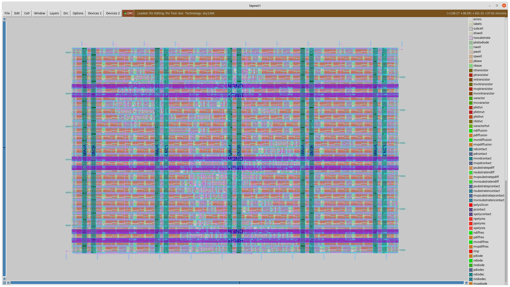

minimal example of generating a magic file from verilog with openlane.

Just run `bash verilog_to_magic.sh`.

Based on https://github.com/algofoogle/tt06-grab-bag . Refer to that for lots of other important details, particularly pin_order.cfg.

(Install the tools you need by cloning https://github.com/efabless/caravel_user_project and running `make setup`.)

